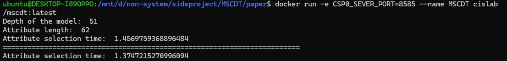
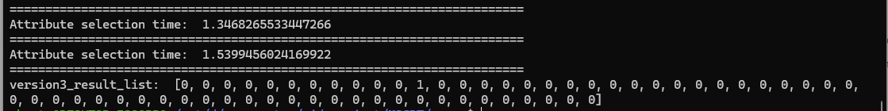

# MSCDT

Build docker image:
```shell=
docker build -t="cislab/mscdt" .
```

Run the MSCDT protocol example:
```shell=
docker run --name MSCDT cislab/mscdt:latest
```
or run with customer IP, PORT
```shell=
docker run -e CSP0_SEVER_IP=127.0.0.1 -e CSP0_SEVER_PORT=8585 --name MSCDT cislab/mscdt:latest
```


