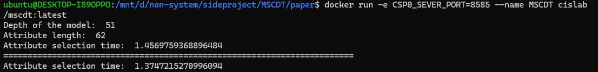
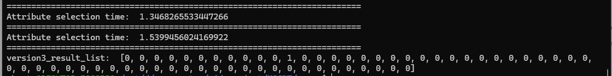
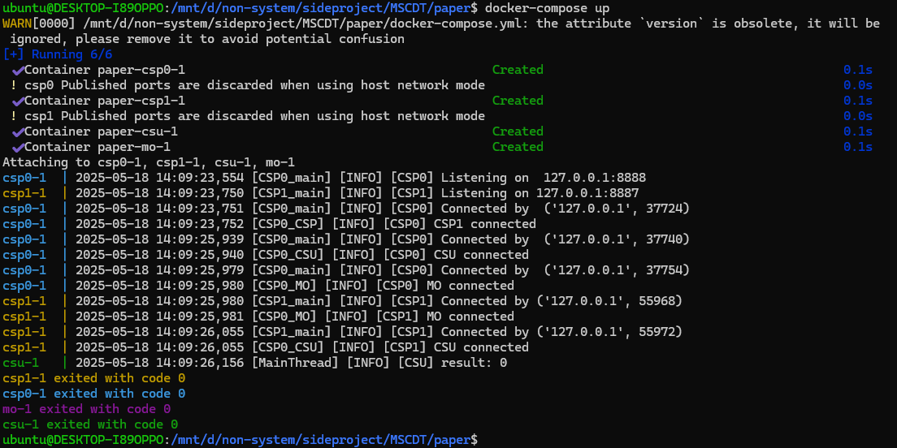

# MSCDT
## 1
Build docker image:
```shell=
docker build -t="cislab/mscdt" .
```

Run the MSCDT protocol example:
```shell=
docker run --name MSCDT cislab/mscdt:latest
```
or run with customer IP, PORT
```shell=
docker run -e CSP0_SEVER_IP=127.0.0.1 -e CSP0_SEVER_PORT=8585 --name MSCDT cislab/mscdt:latest
```




### 2. docker-compose
Build independent Docker images of MO, CSU, CSP0, and CSP1.
```shell=
./docker_build.sh
```

Run the images:
```shell=
docker-compose up
```

